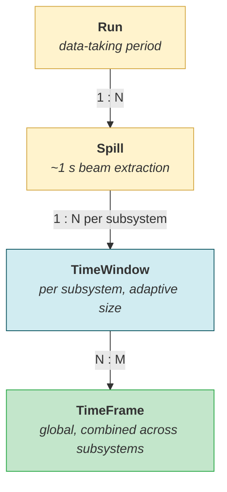
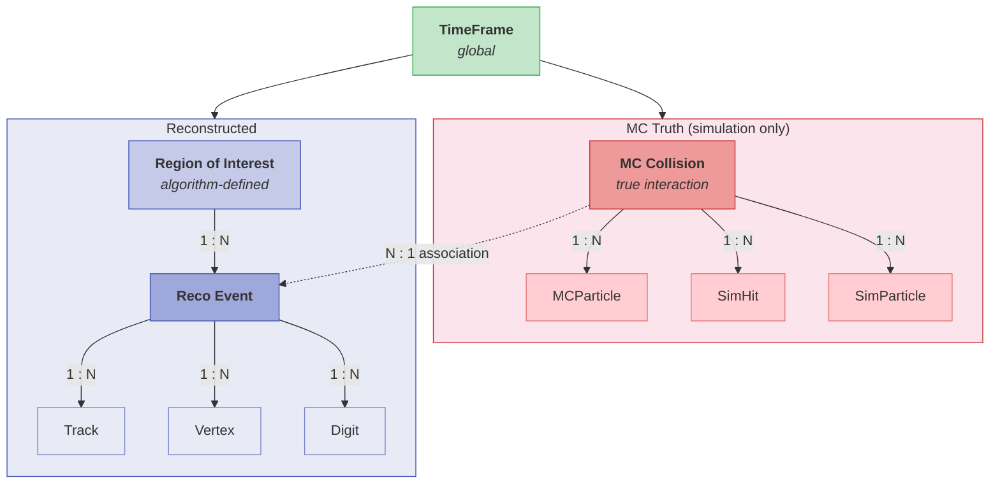
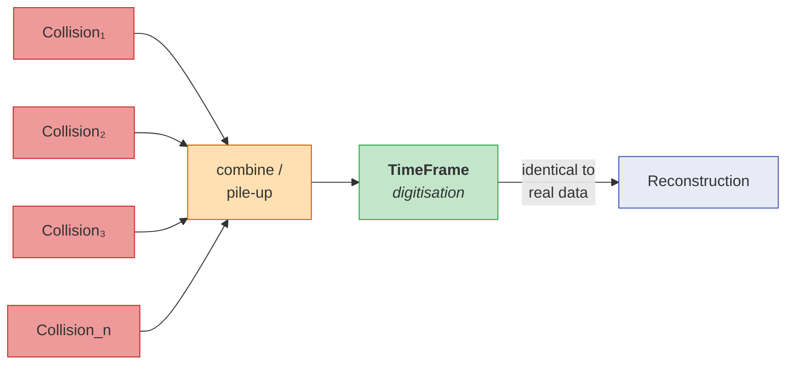

# SHiP Data Model Hierarchy

## Data Acquisition

Real data flows from data-taking runs through to global time frames. The detector is read out continuously over each spill (~1 s) without a trigger. Each subsystem produces adaptive-size time windows at irregular intervals, which are then combined across subsystems into global time frames.

The time window to time frame relationship is N:M because the adaptive time windows from different subsystems do not necessarily align: a single time window may contribute to more than one time frame, and each time frame combines time windows from multiple subsystems.

## Below the Time Frame

The time frame is the convergence point between simulated and real data. Below it, two parallel trees exist: MC truth (present only in simulation) and reconstructed data.

Reconstruction breaks each time frame into algorithm-defined regions of interest, which are further resolved into individual events. On the MC truth side, each true collision fans out into its constituent particles and hits.

Several true collisions can contribute to a single reconstructed event (due to pile-up).

## Simulation Data Flow

In simulation, individual proton-on-target collisions are generated independently. Before digitisation, they are combined over the time window to model pile-up. After digitisation at the time frame level, the simulated data is indistinguishable from real global time frames and follows the same reconstruction path.

